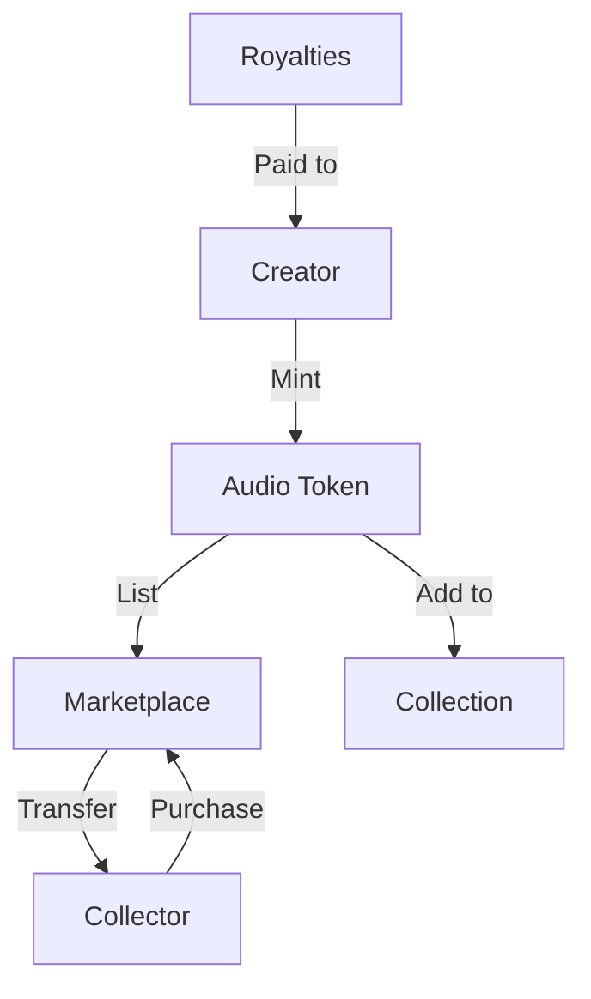

# SoundLoop Token Platform

A decentralized platform for creating, trading, and collecting unique audio assets on the Stacks blockchain.

## Overview

SoundLoop Token Platform transforms audio creations into tradable digital assets, enabling creators to:
- Mint unique sound loops, ringtones, and audio snippets as tokens
- Set and earn royalties on secondary sales
- Create and manage collections of audio assets
- Build a following and monetize their audio creations

The platform features a comprehensive marketplace where collectors can discover, purchase, and trade audio assets while creators maintain ongoing revenue through royalty payments.

## Architecture

The platform is built around a central smart contract that manages the entire lifecycle of audio tokens, from creation to trading and collection management.



### Key Components
- **Token Management**: Handles minting, ownership, and metadata
- **Marketplace**: Enables listing, unlisting, and purchasing of tokens
- **Collections**: Allows grouping and curation of audio assets
- **Royalty System**: Automated royalty payments to creators
- **Provenance Tracking**: Records complete ownership history

## Contract Documentation

### sound-loop-token Contract

The main contract managing the SoundLoop platform functionality.

#### Core Features
- Token minting with metadata and royalty settings
- Token ownership management and transfers
- Marketplace functionality (listing, unlisting, purchasing)
- Collection creation and management
- Provenance tracking
- Royalty distribution

#### Access Control
- Token operations restricted to token owners
- Collection operations restricted to collection creators
- Metadata updates restricted to token creators
- Royalty payments handled automatically during sales

## Getting Started

### Prerequisites
- Clarinet CLI installed
- Stacks wallet for transactions

### Basic Usage

1. Minting a new audio token:
```clarity
(contract-call? .sound-loop-token mint-token 
    "My Audio Track" 
    "A unique sound creation" 
    "https://audiourl.com/track1" 
    u180 
    u10)
```

2. Listing a token for sale:
```clarity
(contract-call? .sound-loop-token list-token u1 u1000)
```

3. Purchasing a token:
```clarity
(contract-call? .sound-loop-token buy-token u1)
```

## Function Reference

### Token Management

#### mint-token
```clarity
(mint-token 
    (title (string-utf8 100))
    (description (string-utf8 500))
    (audio-url (string-utf8 256))
    (audio-length uint)
    (royalty-percentage uint))
```

#### transfer-token
```clarity
(transfer-token (token-id uint) (recipient principal))
```

### Marketplace Functions

#### list-token
```clarity
(list-token (token-id uint) (price uint))
```

#### unlist-token
```clarity
(unlist-token (token-id uint))
```

#### buy-token
```clarity
(buy-token (token-id uint))
```

### Collection Management

#### create-collection
```clarity
(create-collection (name (string-utf8 100)) (description (string-utf8 500)))
```

#### add-token-to-collection
```clarity
(add-token-to-collection (token-id uint) (collection-id uint))
```

## Development

### Testing
1. Clone the repository
2. Install dependencies with `clarinet install`
3. Run tests with `clarinet test`

### Local Development
1. Start local Clarinet console: `clarinet console`
2. Deploy contracts: `clarinet deploy`
3. Interact with contracts using the console

## Security Considerations

### Limitations
- Maximum royalty percentage: 30%
- Collection size limit: 100 tokens
- Provenance history limit: 50 entries
- Maximum tokens per owner: 1000

### Best Practices
- Always verify token ownership before transactions
- Check token listing status before transfers
- Ensure sufficient STX balance for purchases
- Verify royalty percentages are within allowed range
- Monitor transaction status for successful completion